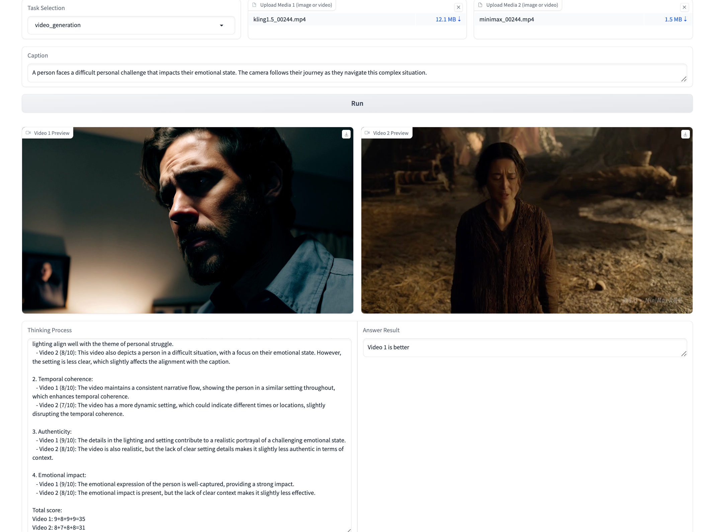

<div align="center">
    <h1 align="center"> Unified Multimodal Chain-of-Thought Reward Model
through Reinforcement Fine-Tuning
    </h1>


<a href="https://arxiv.org/pdf/2505.03318">
</a>

<a href="https://huggingface.co/CodeGoat24/UnifiedReward-Think-qwen3vl-8b">

<a href="https://huggingface.co/CodeGoat24/UnifiedReward-Think-qwen-7b">

</a>
<a href="https://huggingface.co/CodeGoat24/UnifiedReward-Think-7b">

</a>

<a href="https://codegoat24.github.io/UnifiedReward/think">
</a>
<br>


[](https://huggingface.co/collections/CodeGoat24/unifiedreward-models-67c3008148c3a380d15ac63a)
[](https://huggingface.co/collections/CodeGoat24/unifiedreward-training-data-67c300d4fd5eff00fa7f1ede)


</div>

## 🔥 News
😊 We are actively gathering feedback from the community to improve our models. **We welcome your input and encourage you to stay updated through our repository**!!

Please leave us a star ⭐ if you find our work helpful.

- [2025/11/17] 🔥🔥🔥 We release **UnifiedReward-Think-qwen3vl**-[[2b](https://huggingface.co/CodeGoat24/UnifiedReward-Think-qwen3vl-2b)/[4b](https://huggingface.co/CodeGoat24/UnifiedReward-Think-qwen3vl-4b)/[8b](https://huggingface.co/CodeGoat24/UnifiedReward-Think-qwen3vl-8b)/[32b](https://huggingface.co/CodeGoat24/UnifiedReward-Think-qwen3vl-32b)]. The inference code is provided at [here](https://github.com/CodeGoat24/UnifiedReward/tree/main/UnifiedReward-Think/inference_qwen/UnifiedReward-Think-qwen3vl-inference).
- [2025/6/4] 🔥🔥 We released [UnifiedReward-Think-qwen-7b](https://huggingface.co/CodeGoat24/UnifiedReward-Think-qwen-7b)!! All inference and evaluation code are provided in `inference_qwen` and `benchmark_evaluation` directories. 
- [2025/5/10] 🔥 We released Gradio code in `./UnifiedReward-Think/gradio` directory!
- [2025/5/6] 🔥 We released the evaluation code in `benchmark_evaluation` directory and all CoT reward reasoning codes in `./inference` directory.
- [2025/5/6] 🔥 We released our LLaVA-based multimodal GRPO training code.
- [2025/5/6] 🔥 We released our constructed cold-start dataset [ImageGen-CoT-Reward-5K](https://huggingface.co/datasets/CodeGoat24/ImageGen-CoT-Reward-5K) and GRPO training dataset in [Huggingface](https://huggingface.co/collections/CodeGoat24/unifiedreward-training-data-67c300d4fd5eff00fa7f1ede).
- [2025/5/6] 🔥 We released the [project page](https://codegoat24.github.io/UnifiedReward/think) and [paper](https://arxiv.org/pdf/2505.03318).

## 📖 Introduction

This repository releases the **UnifiedReward-Think** -- the first unified multimodal CoT reward model, capable of multi-dimensional, step-by-step long-chain reasoning for both visual understanding and generation reward tasks.


##  🔧 Environment Set Up

1. Clone this repository and navigate to the UnifiedReward folder:
```bash
git clone https://github.com/CodeGoat24/UnifiedReward.git
cd UnifiedReward/UnifiedReward-Think
```

2. Install the training package:
```bash
conda create -n unifiedreward-think python=3.10
conda activate unifiedreward-think
pip install -e ".[dev]"
pip install flash_attn --no-build-isolation
```


## 😄 Gradio Demo
1. Install the gradio package:
```bash
pip install gradio
```
2. Run

```bash
python gradio/app.py
```
<p align="left" width="100%">

</p>

## 💻 Training
### LLaVA-based Training
#### Stage 1. Cold Start 

##### Data Preparation
For cold start, we have released our image generation CoT reward reasoning cold-start dataset [ImageGen-CoT-Reward-5K](https://huggingface.co/datasets/CodeGoat24/ImageGen-CoT-Reward-5K).

##### Training

```
bash 0.cold_start.sh
```

#### Stage 2. Rejection Sampling 

##### Data Preparation
For rejection sampling, you should use the cold-started reward model to infer over the large-scale training data introduced in our paper. 
Samples that are correctly predicted by the model should be retained and used for rejection sampling.

All our training datasets are available at [Huggingface](https://huggingface.co/collections/CodeGoat24/unifiedreward-training-data-67c300d4fd5eff00fa7f1ede). You should preprocess these data for reward model inference. 

The prompt templates for each task are provided in the `./inference` directory.

Each rejection sampling training data should follow this format:
```
{
  "conversations": [
    {
      "from": "human",
      "value": "..."  // The CoT reasoning question or prompt
    },
    {
      "from": "gpt",
      "value": "<think>...</think>\n<answer>...</answer>"  // CoT reasoning and final answer
    }
  ],
  "images": [
    "image_1_path",
    "...",
    "image_n_path"
  ]
}
```
##### Training

```
bash 1.rejection_sampling.sh
```
#### Stage 3. GRPO 

##### Data Preparation
Samples that are incorrectly predicted by the reward model should be used for GRPO training. 

Each GRPO data should be formatted as:

```
{
  "problem": "..." ,  // The CoT reasoning question or prompt
  "solution": "Image/Video/Answer X is better",  // Preference decision
  "images": [
    "image_1_path",
    "...",
    "image_n_path"
  ]
}
```

##### Training
```bash
bash grpo.sh
```

### Qwen-based Training
For cold start and rejection sampling, we adopt [LLaMA-Factory](https://github.com/hiyouga/LLaMA-Factory) training framework.

Follow this [README](https://github.com/hiyouga/LLaMA-Factory/blob/main/data/README.md) ([Multimodal Image Dataset](https://github.com/hiyouga/LLaMA-Factory/blob/main/data/mllm_demo.json)) to prepare the datasets.

For GRPO, we use [EasyR1](https://github.com/hiyouga/EasyR1) for efficient training.

We also provide TRL-based GRPO code in `src/open_r1` directory.

```bash
bash qwen_grpo.sh
```

## 🚀 Inference and Evaluation

We provide reference CoT Reward reasoning codes for each task in the `./inference` and `./inference_qwen` directories.

```bash
inference
├── image_generation                  
    ├── infer_cot_image_generation.py                 
├── video_understanding                 
    ├── infer_cot_video_understanding.py
... 
```
Note that our model is not constrained to a fixed input prompt style.
You can flexibly adjust inputs based on your requirements.

We provide evaluation code for [GenAI-Bench-Video](https://github.com/TIGER-AI-Lab/GenAI-Bench), [GenAI-Bench-Image](https://github.com/TIGER-AI-Lab/GenAI-Bench), [VideoGen-RewardBench](https://huggingface.co/datasets/KwaiVGI/VideoGen-RewardBench) and [VL-RewardBench](https://huggingface.co/datasets/MMInstruction/VL-RewardBench) benchmarks.


## 📧 Contact

If you have any comments or questions, please open a new issue or feel free to contact [Yibin Wang](https://codegoat24.github.io).


## ⭐ Citation
```bibtex
@article{unifiedreward-think,
  title={Unified multimodal chain-of-thought reward model through reinforcement fine-tuning},
  author={Wang, Yibin and Li, Zhimin and Zang, Yuhang and Wang, Chunyu and Lu, Qinglin and Jin, Cheng and Wang, Jiaqi},
  journal={arXiv preprint arXiv:2505.03318},
  year={2025}
}

@article{unifiedreward,
  title={Unified reward model for multimodal understanding and generation},
  author={Wang, Yibin and Zang, Yuhang and Li, Hao and Jin, Cheng and Wang, Jiaqi},
  journal={arXiv preprint arXiv:2503.05236},
  year={2025}
}
```

## 🖼️ More Qualitative Cases


